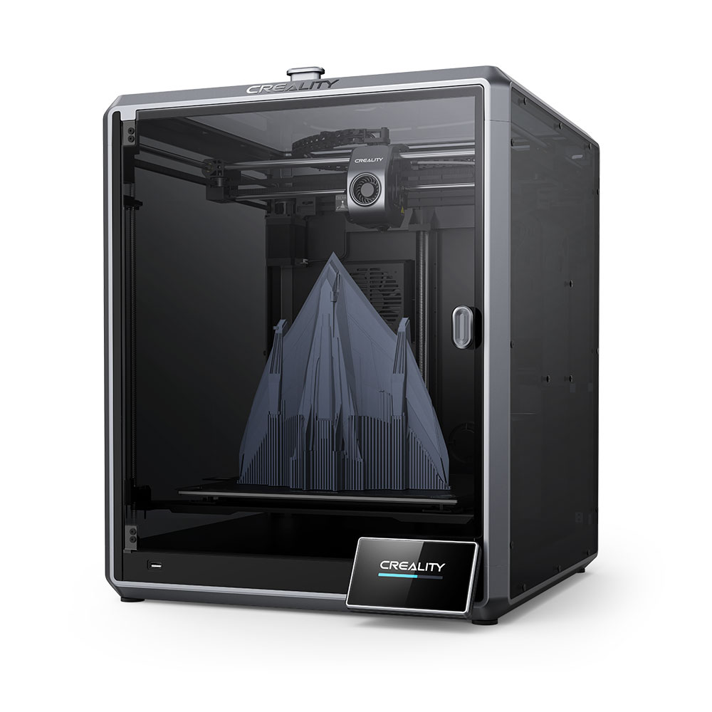

# 🖨️ Manual de Impresión 3D — Creality K1 Max

Bienvenido al repositorio **3d-printer-manual**. Este proyecto es una recopilación de guías, tutoriales y configuraciones prácticas para la calibración, el ajuste y el mantenimiento de la **Creality K1 Max** (o impresoras similares con cámara cerrada y firmware Klipper/Mainsail).

> **Nota:** Las guías, macros y configuraciones de este repositorio están diseñadas específicamente para la Creality K1 Max. Si usas otra impresora, algunos pasos (como las macros de calentamiento de cámara o las referencias a ventiladores 5015) pueden no aplicar directamente.

## 📚 Índice de Guías

Aquí encontrarás todas las guías detalladas disponibles actualmente:

* [🛠️ Guía de Calibración del Z-Offset](./zoffset-caibration.md)
  > Aprende a ajustar la distancia perfecta entre la boquilla y la cama de impresión paso a paso. Incluye preparación térmica, el método del papel, ajustes "al vuelo" durante la impresión y cómo guardar la configuración permanentemente.

* [🗺️ Calibración de la Cama (Bed Mesh)](./bed-mesh-calibration.md)
  > Genera y guarda la malla topográfica de la cama de impresión. Explica cómo crear y guardar perfiles para distintos materiales y temperaturas (ej. `BED_MESH_PROFILE SAVE=cr_abs`) y cómo cargarlos.

* [💪 Guía de Resistencia de Filamentos](./filamentos-resistencia.md)
  > Comparativa y análisis técnico de las propiedades mecánicas (tracción, flexión e impacto) de los filamentos de impresión 3D más comunes (PLA, PETG, ABS, Nylon, PC, TPU, etc.).

* [🔥 Calentamiento rápido de cámara (HEATSOAK_CHAMBER)](./heatsoak-chamber.md)
  > Macro para acelerar el precalentamiento de la cámara con convección forzada y ventiladores 5015, optimizada para ABS en impresoras con cámara cerrada.

* [🌀 Mod Ventiladores en la Cama (Bed Fans)](./bed-fans-mod.md)
  > Hardware mod para reducir el tiempo de calentamiento de cámara a la mitad. Incluye piezas imprimibles y guía de instalación para la Creality K1 Max.

---

*Se irán añadiendo más guías y tutoriales próximamente...*
