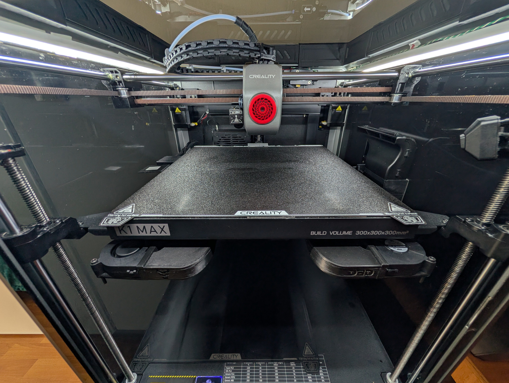

# 🌀 Mod de Ventiladores en la Cama (Bed Fans) — Creality K1 Max

Este mod monta **dos ventiladores sobre la cama** para acelerar drásticamente el calentamiento de la cámara. Está especialmente diseñado para filamentos con alto warping como **ABS**.

## Beneficios

- **Tiempo de calentamiento reducido a la mitad** — Los ventiladores montados en la cama recirculan el aire caliente de forma directa y eficiente.
- **Mejor distribución de calor** — El aire caliente se genera desde la base, eliminando puntos fríos en la parte inferior de la cámara.
- **Ideal para ABS** — Al reducir el tiempo de espera, se minimiza la degradación del filamento por humedad y se acelera el inicio de la impresión.

## Configuración de ventiladores

> **IMPORTANTE:** Al instalar este mod, **desconecta el ventilador trasero** original de la cámara. No es necesario utilizarlo. En su lugar, conecta los **dos nuevos ventiladores montados sobre la cama**.

| Configuración | Ventilador trasero | Ventiladores en cama |
| :--- | :---: | :---: |
| **Sin mod (original)** | Conectado | — |
| **Con mod (bed fans)** | **Desconectado** | **2x conectados** |

## Piezas necesarias

Las piezas de montaje se imprimen con el mismo filamento que usarás para imprimir (recomendado: **ABS** o **ASA** para resistencia térmica).

📦 **Descarga las piezas desde Printables:**
- [Creality K1 Max - D3D Bed Fans](https://www.printables.com/model/871831-creality-k1-max-d3d-bed-fans?lang=es) — Opción principal
- [K1 Max Bed Fan Ducts (No Logos)](https://www.printables.com/model/1491996-k1-max-bed-fan-ducts-no-logos) — Alternativa sin logotipos

## Instalación visual

