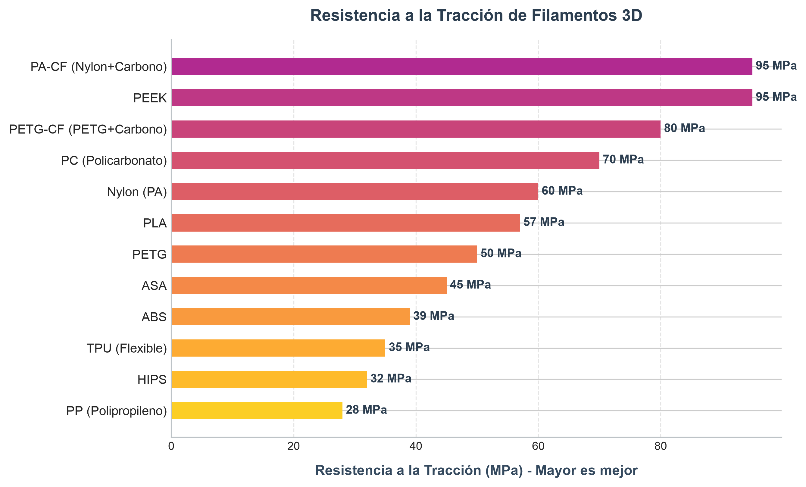
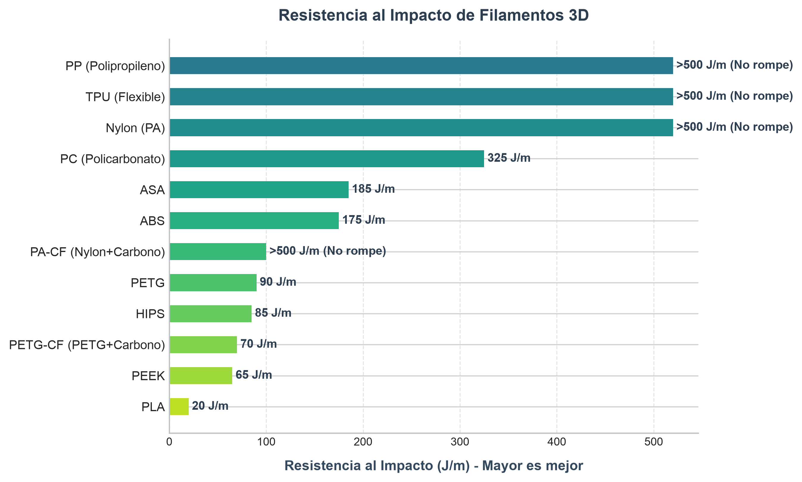
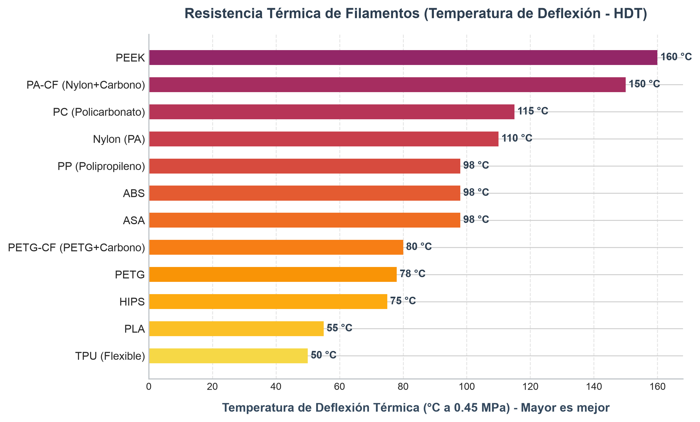
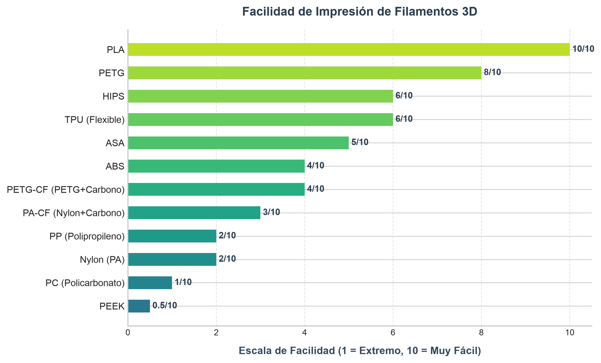
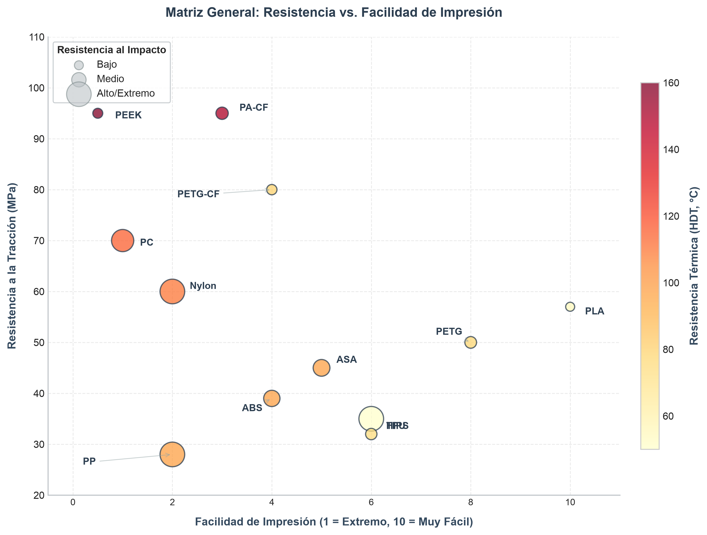
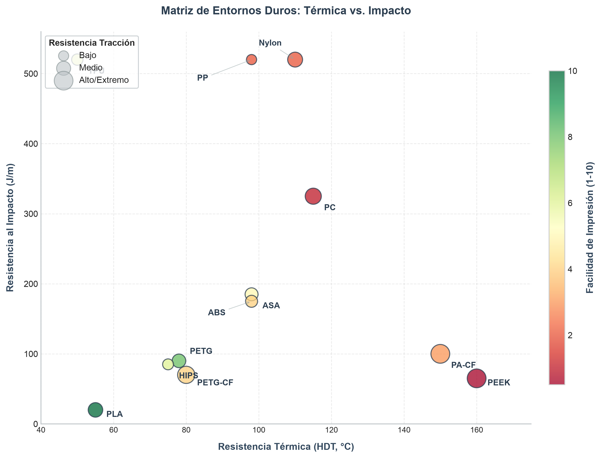
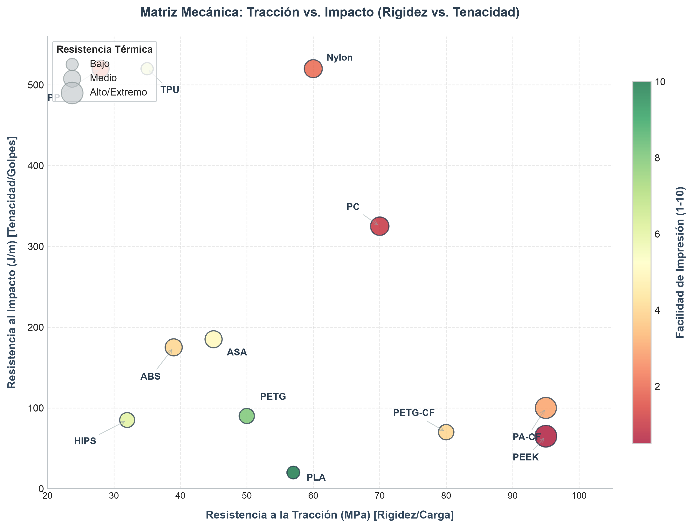

# Guía de Resistencia de Filamentos de Impresión 3D

Al diseñar piezas para impresión 3D, elegir el material correcto es fundamental para garantizar su viabilidad mecánica. A continuación, se presenta un análisis detallado, tablas comparativas y gráficos visuales de las propiedades mecánicas de la gama completa de filamentos disponibles en el mercado.

> **Nota sobre la Anisotropía:** Las piezas impresas en 3D (FDM/FFF) son anisotrópicas. Esto significa que la resistencia mecánica varía según la dirección de los esfuerzos respecto a la orientación de las capas. Una pieza siempre será mucho más débil en el eje Z (separación entre capas) que en los ejes X e Y (dirección del filamento extruido).

---

## 📊 Gráficos Comparativos de Rendimiento (Visual)

Para facilitar la toma de decisiones, a continuación se presentan los gráficos comparativos de barras generados directamente a partir de las especificaciones mecánicas y térmicas de cada filamento:

### 1. Resistencia a la Tracción (MPa)
*Mide la capacidad de soportar fuerzas de estiramiento y cargas pesadas antes de romperse (promedios en MPa, eje X-Y).*

### 2. Resistencia al Impacto (J/m)
*Mide la capacidad de absorber energía y resistir golpes directos, caídas y choques repentinos sin quebrarse (promedios en J/m).*

### 3. Resistencia Térmica (Temperatura de Deflexión - HDT a 0.45 MPa)
*Mide la temperatura a partir de la cual el material comienza a ablandarse y deformarse bajo carga estática.*

### 4. Facilidad de Impresión (Escala 1 al 10)
*Evaluación de la dificultad de impresión (adhesión, warping, exigencia de hardware, control de humedad).*

### 5. Matrices de Decisión Multivariable (Análisis Cruzados)

Para resolver decisiones complejas de diseño, estas matrices cruzan 4 variables críticas simultáneamente. El tamaño de cada burbuja representa la variable de soporte (tercera variable) y la barra de color representa la facilidad de impresión o la resistencia térmica (cuarta variable).

#### 5.1 Matriz de Selección General (Resistencia vs. Facilidad)
*Compara la Facilidad de Impresión (Eje X) frente a la Resistencia a la Tracción (Eje Y). El tamaño del círculo representa la Resistencia al Impacto (J/m) y el color representa su Resistencia Térmica (HDT, °C).*

*   **Utilidad:** Ideal para usuarios que buscan maximizar el rendimiento mecánico de tracción sin complicarse con materiales extremadamente complejos de imprimir.

#### 5.2 Matriz de Entornos Duros (Térmica vs. Impacto)
*Compara la Resistencia Térmica de Deflexión (Eje X) frente a la Resistencia al Impacto (Eje Y). El tamaño del círculo representa la Resistencia a la Tracción (MPa) y el color representa la Facilidad de Impresión (escala de rojo = difícil, a verde = fácil).*

*   **Utilidad:** Diseñada para ingenieros que necesitan piezas para entornos mecánicamente agresivos y con altas temperaturas (ej. compartimentos de motor o herramientas de intemperie). Permite encontrar el balance perfecto entre resistir el calor y no fracturarse ante un golpe.

#### 5.3 Matriz de Comportamiento Mecánico (Tracción vs. Impacto)
*Compara la Resistencia a la Tracción (Eje X - Rigidez) frente a la Resistencia al Impacto (Eje Y - Tenacidad). El tamaño del círculo representa la Resistencia Térmica (HDT, °C) y el color representa la Facilidad de Impresión (escala de rojo = difícil, a verde = fácil).*

*   **Utilidad:** Revela el clásico dilema del diseño de materiales: *¿Rigidez estructural o Tenacidad dinámica?* Permite ubicar materiales rígidos pero frágiles (como el PLA) frente a materiales sumamente tenaces pero altamente flexibles (como el TPU o el PP), o polímeros extremos que combinan ambos mundos (como el Policarbonato).

---

## 📋 Tabla Comparativa Completa de Propiedades

| Material | Resistencia a la Tracción (MPa) | Resistencia al Impacto (J/m) | Resistencia Térmica (HDT Aprox. °C) | Facilidad de Impresión | Características Clave y Aplicaciones |
| :--- | :---: | :---: | :---: | :---: | :--- |
| **PLA** | 50 – 65 *(Alta)* | 15 – 25 *(Muy Baja)* | 55 °C | 10 / 10 | Rígido y frágil. Excelente para prototipos visuales y piezas decorativas rápidas. |
| **PETG** | 45 – 55 *(Media-Alta)* | 60 – 120 *(Media)* | 78 °C | 8 / 10 | Muy versátil. Excelente resistencia química, tenaz y con poca contracción. |
| **ABS** | 33 – 45 *(Media)* | 150 – 200 *(Alta)* | 98 °C | 4 / 10 | Tenaz y ligero. Fácil de post-procesar (lijar/acetona). Sufre de *warping* severo. |
| **ASA** | 40 – 50 *(Media)* | 160 – 210 *(Alta)* | 98 °C | 5 / 10 | Excelente para exteriores. Resistente a rayos UV e intemperie. Similar al ABS pero con menor contracción. |
| **Nylon (PA)** | 45 – 75 *(Alta)* | > 500 *(Extrema)* | 110 °C | 2 / 10 | Súper tenaz y flexible. Gran resistencia al desgaste y fatiga. Altamente higroscópico. |
| **Policarbonato (PC)** | 65 – 75 *(Muy Alta)* | 250 – 400 *(Extrema)* | 115 °C | 1 / 10 | Piezas estructurales extremas. Combina alta rigidez con resistencia de impacto masiva. |
| **TPU** | 30 – 40 *(Baja)* | No rompe *(Absorción)*| 50 °C | 6 / 10 | Elastómero flexible. Ideal para juntas, bujes, protectores y amortiguadores de impacto. |
| **PA-CF** | 80 – 110 *(Extrema)* | 80 – 120 *(Media)* | 150 °C | 3 / 10 | Nylon reforzado con carbono. Súper ligero, ultra rígido y estable térmicamente. Muy abrasivo. |
| **PETG-CF** | 70 – 90 *(Muy Alta)* | 60 – 80 *(Baja)* | 80 °C | 4 / 10 | PETG reforzado con carbono. Mayor rigidez estructural que el PETG común con buena facilidad de impresión. |
| **HIPS** | 30 – 35 *(Baja)* | 75 – 100 *(Media)* | 75 °C | 6 / 10 | Utilizado principalmente como material de soporte soluble (en limoneno) para ABS. |
| **PP** | 25 – 32 *(Baja)* | No rompe *(Extrema)* | 98 °C | 2 / 10 | Excelente fatiga mecánica (bisagras vivas) y resistencia química. Muy difícil adherir a la cama. |
| **PEEK** | 90 – 100 *(Extrema)* | 60 – 70 *(Media)* | 160 °C | 0.5 / 10 | Grado aeroespacial y médico. Máxima resistencia química y mecánica. Requiere hardware especializado. |

---

## 🧠 Análisis de Selección: ¿Qué material usar según el esfuerzo?

### 1. Para soportar cargas estáticas sin flectar (Rigidez y Tracción)
*   **Ganador:** **PA-CF** o **PEEK**. 
*   **Alternativa accesible:** **PETG-CF** o **PLA** (en ambientes <50 °C).
*   *Análisis:* La fibra de carbono refuerza la matriz del plástico haciéndolo inmóvil ante cargas axiales de tracción. Si la pieza no va a superar temperaturas moderadas, el PLA tiene una rigidez sorprendente a un precio extremadamente bajo.

### 2. Para soportar golpes directos e impactos repetitivos (Tenacidad)
*   **Ganador:** **Nylon (PA)**, **TPU** o **PP**.
*   **Alternativa rígida:** **Policarbonato (PC)** o **ABS**.
*   *Análisis:* El Nylon y el PP absorben el impacto deformándose microscópicamente de forma elástica y recuperando su forma sin romperse. Si necesitas que la pieza sea rígida y no se mueva, pero aun así soporte caídas fuertes, el **Policarbonato (PC)** es insuperable.

### 3. Para soportar flexión elástica y fatiga (Ganchos, Clips, Bisagras)
*   **Ganador:** **PP (Polipropileno)** o **Nylon (PA)**.
*   **Alternativa común:** **PETG**.
*   *Análisis:* El PP permite crear bisagras funcionales de una sola pieza que pueden doblarse miles de veces sin sufrir fatiga estructural. El Nylon ofrece un comportamiento similar con mayor dureza. El PETG es excelente para clips a presión cotidianos. El PLA se fracturará de inmediato ante esfuerzos de flexión.

### 4. Resistencia a la intemperie y rayos UV (Uso en Exterior)
*   **Ganador:** **ASA**.
*   *Análisis:* La radiación solar y la lluvia degradan la mayoría de plásticos (el ABS se vuelve quebradizo, el PLA se deforma mecánicamente y absorbe humedad). El ASA está formulado específicamente para soportar radiación UV sin perder sus propiedades mecánicas ni decolorarse.

### 5. Resistencia a Altas Temperaturas continuas
*   **Ganador:** **PEEK** o **PA-CF**.
*   **Alternativa común:** **ABS** o **ASA**.
*   *Análisis:* Si la pieza va a ir dentro del compartimento de un motor o cerca de un foco de calor, el PLA fallará catastróficamente de inmediato. El ABS/ASA aguantan cerca del límite del agua hirviendo (~100 °C), pero el PA-CF y el PEEK se mantienen estables en aplicaciones de ingeniería pesada superando los 150 °C de forma continua.