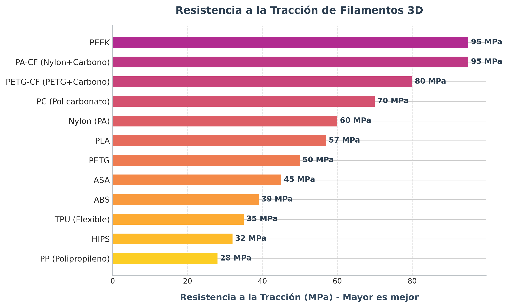
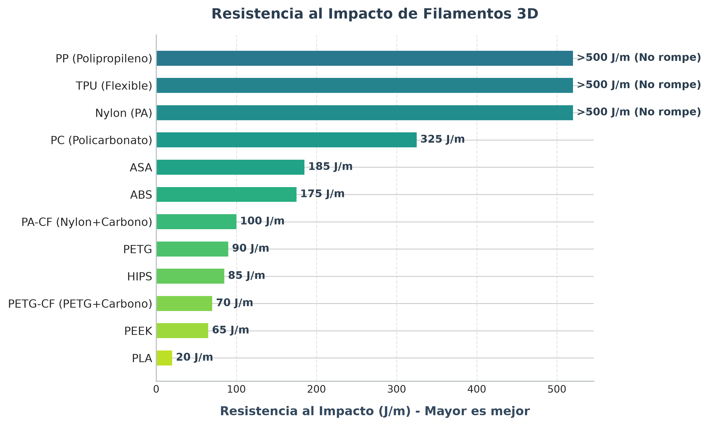
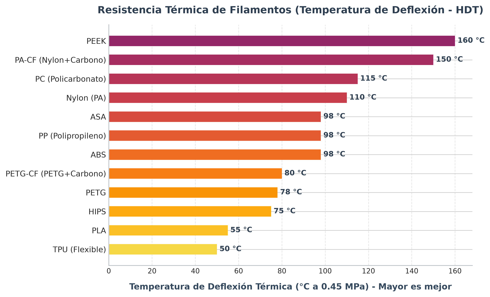
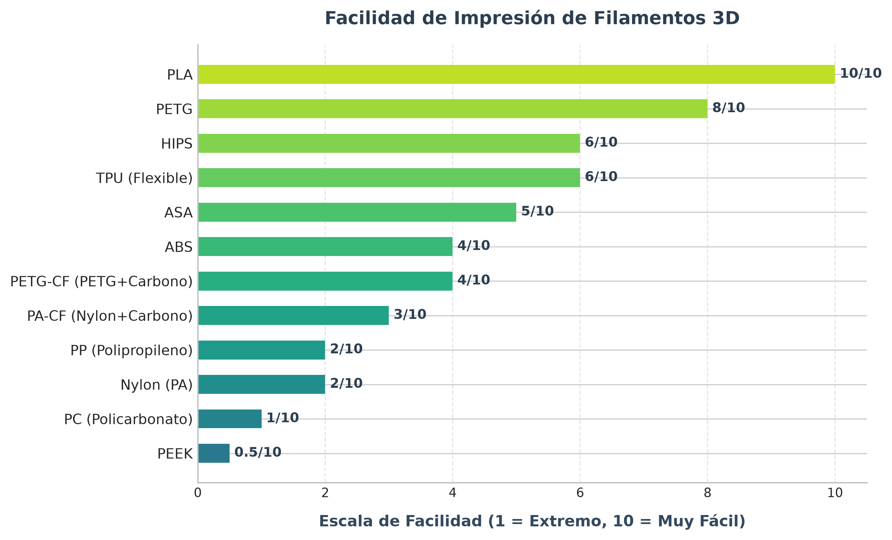
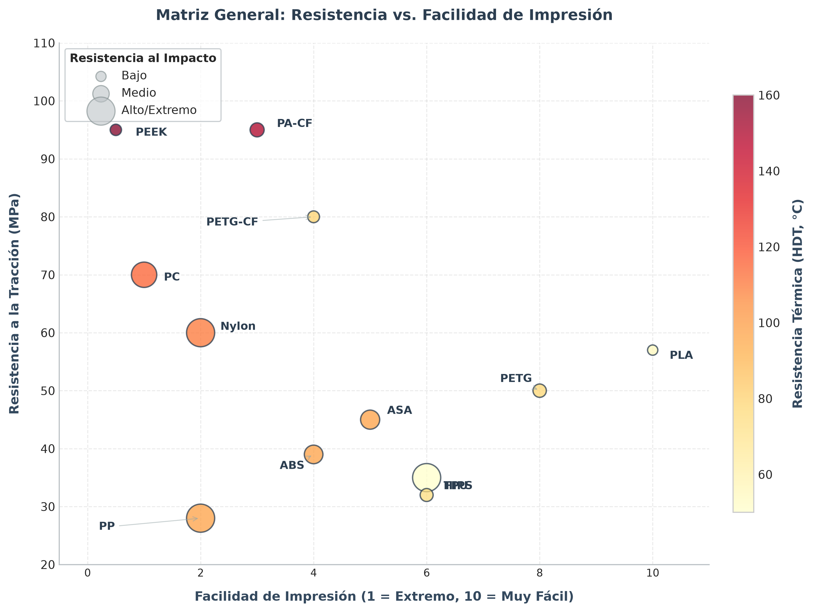
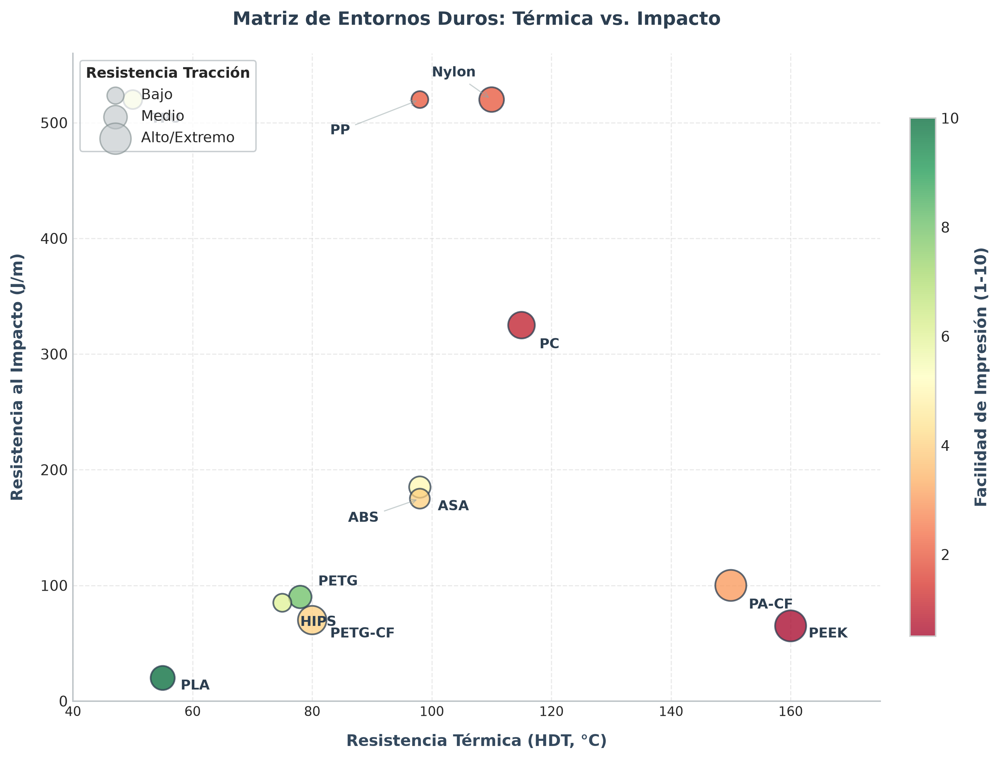
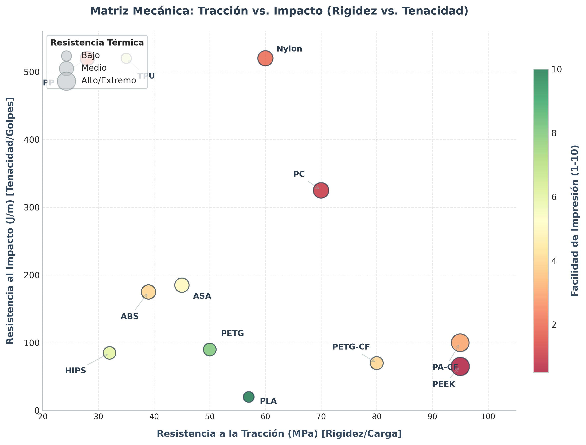

# Guía de Resistencia de Filamentos de Impresión 3D

Al diseñar piezas para impresión 3D, elegir el material correcto es fundamental para garantizar su viabilidad mecánica. A continuación, se presenta un análisis detallado, tablas comparativas y gráficos visuales de las propiedades mecánicas de la gama completa de filamentos disponibles en el mercado.

> **Nota sobre la Anisotropía:** Las piezas impresas en 3D (FDM/FFF) son anisotrópicas. Esto significa que la resistencia mecánica varía según la dirección de los esfuerzos respecto a la orientación de las capas. Una pieza siempre será mucho más débil en el eje Z (separación entre capas) que en los ejes X e Y (dirección del filamento extruido).

---

## 📊 Gráficos Comparativos de Rendimiento (Visual)

Para facilitar la toma de decisiones, a continuación se presentan los gráficos comparativos de barras generados directamente a partir de las especificaciones mecánicas y térmicas de cada filamento:

### 1. Resistencia a la Tracción (MPa)
*Mide la capacidad de soportar fuerzas de estiramiento y cargas pesadas antes de romperse (promedios en MPa, eje X-Y).*

### 2. Resistencia al Impacto (J/m)
*Mide la capacidad de absorber energía y resistir golpes directos, caídas y choques repentinos sin quebrarse (promedios en J/m).*

### 3. Resistencia Térmica (Temperatura de Deflexión - HDT a 0.45 MPa)
*Mide la temperatura a partir de la cual el material comienza a ablandarse y deformarse bajo carga estática.*

### 4. Facilidad de Impresión (Escala 1 al 10)
*Evaluación de la dificultad de impresión (adhesión, warping, exigencia de hardware, control de humedad).*

### 5. Matrices de Decisión Multivariable (Análisis Cruzados)

Para resolver decisiones complejas de diseño, estas matrices cruzan 4 variables críticas simultáneamente. El tamaño de cada burbuja representa la variable de soporte (tercera variable) y la barra de color representa la facilidad de impresión o la resistencia térmica (cuarta variable).

#### Cómo leer estas matrices

Cada gráfico de burbujas muestra 4 variables a la vez:

| Elemento | Qué representa | Cómo interpretarlo |
| :--- | :--- | :--- |
| **Eje X** | Variable principal (varía por matriz) | Más a la derecha = mayor valor |
| **Eje Y** | Variable secundaria (varía por matriz) | Más arriba = mayor valor |
| **Tamaño del círculo** | Tercera variable (ver leyenda) | Círculo más grande = mayor valor |
| **Color del círculo** | Cuarta variable (barra de color) | Verde = fácil/bajo, Rojo = difícil/alto |

**Consejo:** Busca materiales en la **esquina superior derecha** (ambos ejes altos) con **círculos grandes** y **color verde** para la mejor combinación general.

#### 5.1 Matriz de Selección General (Resistencia vs. Facilidad)
*Compara la Facilidad de Impresión (Eje X) frente a la Resistencia a la Tracción (Eje Y). El tamaño del círculo representa la Resistencia al Impacto (J/m) y el color representa su Resistencia Térmica (HDT, °C).*

*   **Utilidad:** Ideal para usuarios que buscan maximizar el rendimiento mecánico de tracción sin complicarse con materiales extremadamente complejos de imprimir.

#### 5.2 Matriz de Entornos Duros (Térmica vs. Impacto)
*Compara la Resistencia Térmica de Deflexión (Eje X) frente a la Resistencia al Impacto (Eje Y). El tamaño del círculo representa la Resistencia a la Tracción (MPa) y el color representa la Facilidad de Impresión (escala de rojo = difícil, a verde = fácil).*

*   **Utilidad:** Diseñada para ingenieros que necesitan piezas para entornos mecánicamente agresivos y con altas temperaturas (ej. compartimentos de motor o herramientas de intemperie). Permite encontrar el balance perfecto entre resistir el calor y no fracturarse ante un golpe.

#### 5.3 Matriz de Comportamiento Mecánico (Tracción vs. Impacto)
*Compara la Resistencia a la Tracción (Eje X - Rigidez) frente a la Resistencia al Impacto (Eje Y - Tenacidad). El tamaño del círculo representa la Resistencia Térmica (HDT, °C) y el color representa la Facilidad de Impresión (escala de rojo = difícil, a verde = fácil).*

*   **Utilidad:** Revela el clásico dilema del diseño de materiales: *¿Rigidez estructural o Tenacidad dinámica?* Permite ubicar materiales rígidos pero frágiles (como el PLA) frente a materiales sumamente tenaces pero altamente flexibles (como el TPU o el PP), o polímeros extremos que combinan ambos mundos (como el Policarbonato).

---

## 📋 Tabla Comparativa Completa de Propiedades

### Propiedades Mecánicas

| Material | Resistencia a la Tracción (MPa) | Resistencia al Impacto (J/m) | Densidad (g/cm³) | Características Clave |
| :--- | :---: | :---: | :---: | :--- |
| **PLA** | 50 – 65 | 15 – 25 | 1.24 | Rígido y frágil. Excelente para prototipos visuales y piezas decorativas. |
| **PETG** | 45 – 55 | 60 – 120 | 1.27 | Muy versátil. Tenaz, baja contracción, buena resistencia química. |
| **ABS** | 33 – 45 | 150 – 200 | 1.04 | Tenaz y ligero. Fácil post-procesar (lijar/acetona). Warping severo. |
| **ASA** | 40 – 50 | 160 – 210 | 1.07 | Similar al ABS. Resistente a rayos UV e intemperie. |
| **Nylon (PA)** | 45 – 75 | > 500 *(No rompe)* | 1.14 | Súper tenaz. Gran resistencia al desgaste y fatiga. |
| **Policarbonato (PC)** | 65 – 75 | 250 – 400 | 1.20 | Alta rigidez + resistencia de impacto masiva. Piezas estructurales. |
| **TPU** | 30 – 40 | > 500 *(No rompe)* | 1.21 | Elastómero flexible. Juntas, bujes, amortiguadores. |
| **PA-CF** | 80 – 110 | 80 – 120 | 1.10 | Nylon + fibra de carbono. Ultra rígido, estable térmicamente. |
| **PETG-CF** | 70 – 90 | 60 – 80 | 1.30 | PETG + carbono. Mayor rigidez que PETG común. |
| **HIPS** | 30 – 35 | 75 – 100 | 1.04 | Material de soporte soluble (limoneno) para ABS. |
| **PP** | 25 – 32 | > 500 *(No rompe)* | 0.90 | Bisagras vivas, fatiga mecánica. Muy ligero. |
| **PEEK** | 90 – 100 | 60 – 70 | 1.31 | Grado aeroespacial. Máxima resistencia química y mecánica. |

### Propiedades Térmicas y de Impresión

| Material | Temp. Deflexión HDT (°C) | Temp. Boquilla (°C) | Temp. Cama (°C) | Absorción Humedad | Facilidad Impresión |
| :--- | :---: | :---: | :---: | :---: | :---: |
| **PLA** | 55 | 190 – 220 | 50 – 60 | Baja (~0.4%) | 10 / 10 |
| **PETG** | 78 | 220 – 250 | 70 – 80 | Baja (~0.5%) | 8 / 10 |
| **ABS** | 98 | 220 – 260 | 95 – 110 | Baja (~0.3%) | 4 / 10 |
| **ASA** | 98 | 230 – 260 | 90 – 110 | Baja (~0.3%) | 5 / 10 |
| **Nylon (PA)** | 110 | 240 – 270 | 70 – 90 | **Alta (~8%)** | 2 / 10 |
| **Policarbonato (PC)** | 115 | 270 – 310 | 100 – 120 | Media (~0.2%) | 1 / 10 |
| **TPU** | 50 | 210 – 240 | 50 – 60 | Baja (~0.5%) | 6 / 10 |
| **PA-CF** | 150 | 250 – 280 | 80 – 100 | **Alta (~6%)** | 3 / 10 |
| **PETG-CF** | 80 | 230 – 260 | 80 – 100 | Baja (~0.4%) | 4 / 10 |
| **HIPS** | 75 | 220 – 250 | 90 – 110 | Baja (~0.3%) | 6 / 10 |
| **PP** | 98 | 220 – 260 | 90 – 110 | Muy Baja (~0.03%) | 2 / 10 |
| **PEEK** | 160 | 360 – 420 | 120 – 160 | Baja (~0.1%) | 0.5 / 10 |

### Requisitos de Hardware

| Material | Boquilla Especial | Cama Caliente | Cerrada | Notas |
| :--- | :---: | :---: | :---: | :--- |
| **PLA** | No | Opcional | No | Cualquier impresora. Ideal para empezar. |
| **PETG** | No | Recomendada | No | Evitar cooling excesivo. |
| **ABS** | No | Obligatoria | **Sí** | Warping severo sin cerrada. Olores fuertes. |
| **ASA** | No | Obligatoria | **Sí** | Similar a ABS pero menos olor. |
| **Nylon (PA)** | Acero endurecido | Recomendada | **Sí** | Altamente higroscópico. Secar antes de usar. |
| **Policarbonato (PC)** | Acero endurecido | Obligatoria | **Sí** | Exige hardware de alta temperatura. |
| **TPU** | Directo (sin Bowden) | Opcional | No | Lenta velocidad. Extrusión restringida. |
| **PA-CF** | **Acero endurecido** | Recomendada | **Sí** | Muy abrasivo. Daña boquillas de latón. |
| **PETG-CF** | **Acero endurecido** | Recomendada | No | Abrasivo. No usar boquilla de latón. |
| **HIPS** | No | Obligatoria | **Sí** | Se usa como soporte, no como material principal. |
| **PP** | No | Obligatoria | **Sí** | Muy difícil adherir. Usar cinta adhesiva o PEI. |
| **PEEK** | **Acero endurecido** | Obligatoria | **Sí** | Hardware especializado. Impresoras industriales. |

---

## 🧠 Análisis de Selección: ¿Qué material usar según el esfuerzo?

### 1. Para soportar cargas estáticas sin flectar (Rigidez y Tracción)
*   **Ganador:** **PA-CF** o **PEEK**. 
*   **Alternativa accesible:** **PETG-CF** o **PLA** (en ambientes <50 °C).
*   *Análisis:* La fibra de carbono refuerza la matriz del plástico haciéndolo inmóvil ante cargas axiales de tracción. Si la pieza no va a superar temperaturas moderadas, el PLA tiene una rigidez sorprendente a un precio extremadamente bajo.

### 2. Para soportar golpes directos e impactos repetitivos (Tenacidad)
*   **Ganador:** **Nylon (PA)**, **TPU** o **PP**.
*   **Alternativa rígida:** **Policarbonato (PC)** o **ABS**.
*   *Análisis:* El Nylon y el PP absorben el impacto deformándose microscópicamente de forma elástica y recuperando su forma sin romperse. Si necesitas que la pieza sea rígida y no se mueva, pero aun así soporte caídas fuertes, el **Policarbonato (PC)** es insuperable.

### 3. Para soportar flexión elástica y fatiga (Ganchos, Clips, Bisagras)
*   **Ganador:** **PP (Polipropileno)** o **Nylon (PA)**.
*   **Alternativa común:** **PETG**.
*   *Análisis:* El PP permite crear bisagras funcionales de una sola pieza que pueden doblarse miles de veces sin sufrir fatiga estructural. El Nylon ofrece un comportamiento similar con mayor dureza. El PETG es excelente para clips a presión cotidianos. El PLA se fracturará de inmediato ante esfuerzos de flexión.

### 4. Resistencia a la intemperie y rayos UV (Uso en Exterior)
*   **Ganador:** **ASA**.
*   *Análisis:* La radiación solar y la lluvia degradan la mayoría de plásticos (el ABS se vuelve quebradizo, el PLA se deforma mecánicamente y absorbe humedad). El ASA está formulado específicamente para soportar radiación UV sin perder sus propiedades mecánicas ni decolorarse.

### 5. Resistencia a Altas Temperaturas continuas
*   **Ganador:** **PEEK** o **PA-CF**.
*   **Alternativa común:** **ABS** o **ASA**.
*   *Análisis:* Si la pieza va a ir dentro del compartimento de un motor o cerca de un foco de calor, el PLA fallará catastróficamente de inmediato. El ABS/ASA aguantan cerca del límite del agua hirviendo (~100 °C), pero el PA-CF y el PEEK se mantienen estables en aplicaciones de ingeniería pesada superando los 150 °C de forma continua.